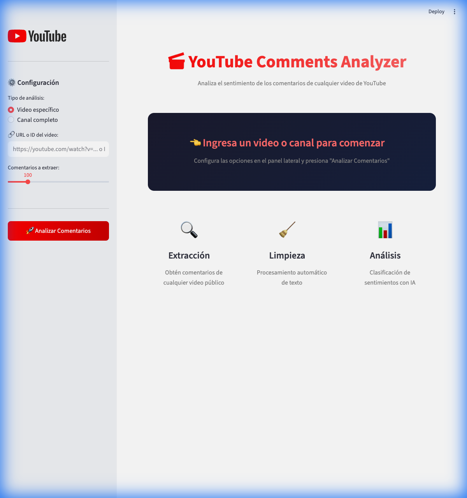

# YouTube Comments Scraper - Walkthrough

📍 **Repositorio**: [https://github.com/alex812hr/Scrapping-yt](https://github.com/alex812hr/Scrapping-yt)

Proyecto completo para extraer, limpiar y analizar sentimientos de comentarios de YouTube.

## 🚀 Interfaz Web (Streamlit)



Para iniciar la interfaz gráfica:

```bash
streamlit run app.py
```

La interfaz incluye:

- Formulario para ingresar URL/ID de video o canal
- Gráficos interactivos de distribución de sentimientos
- Tabla de datos con filtros
- Botón de descarga CSV

## ✅ Características del Proyecto

1. **Scraping Automatizado**: Conexión con la API v3 de YouTube
2. **Pipeline de Limpieza**: Eliminación de duplicados, normalización, limpieza de emojis/URLs
3. **Análisis de Sentimientos**: Clasificación en Positivo, Neutro y Negativo
4. **Interfaz Web**: Dashboard interactivo con Streamlit

## 📊 Ejemplo de Resultados

Prueba realizada con un video (50 comentarios):

| Sentimiento | Total | Porcentaje |
| ----------- | ----- | ---------- |
| Neutro      | 29    | 58.0%      |
| Positivo    | 18    | 36.0%      |
| Negativo    | 3     | 6.0%       |

## 🛠️ Cómo Usar

### Opción 1: Interfaz Web

```bash
streamlit run app.py
```

### Opción 2: Línea de Comandos

Analizar un video:

```bash
python main.py --video ID_DEL_VIDEO
```

Analizar un canal:

```bash
python main.py --channel ID_DEL_CANAL --videos 5 --comments 100
```

## 📁 Archivos Generados

- `data/raw/comments_raw.json` - Datos crudos de la API
- `data/processed/comments_clean_sentiment.csv` - Datos limpios con análisis

## 💡 Tip

Para encontrar el ID de un video, busca el código después de `v=` en la URL:

```
https://youtube.com/watch?v=59GrCryltng
                            ^^^^^^^^^^^
                            Este es el ID
```
